  <picture>
    <source media="(max-width: 760px) and (prefers-color-scheme: dark)" srcset="./assets/hero/agent-console-ea8b8637-mobile-dark.svg">
    <source media="(max-width: 760px)" srcset="./assets/hero/agent-console-ea8b8637-mobile-light.svg">
    <source media="(prefers-color-scheme: dark)" srcset="./assets/hero/agent-console-ea8b8637-dark.svg">
    <source media="(prefers-color-scheme: light)" srcset="./assets/hero/agent-console-ea8b8637-light.svg">
    
  </picture>

<h1 align="center">Muhammad Idris Marzuki</h1>

  Informatics Engineering Student • Developer • AI Enthusiast

  I'm an Informatics Engineering student interested in
  software development, mobile development,
  and modern web technologies.

---

## 👨‍💻 About Me

- 🎓 Informatics Engineering Student
- 💻 Interested in Software Development
- 📱 Mobile Development with Flutter
- 🌐 Web Development
- 🚀 Always learning and building new projects

---

## 🛠️ Tech Stack

  

---

## 🌐 Socials

---

# 📊 GitHub Stats

 

 

---

## 🏆 GitHub Trophies

---

## 🚀 Featured Projects

### ✈️ HappyTrip

Travel application built with Flutter with features such as
travel recommendations, location-based functionality, and AI-powered
face recognition.

### 🌱 CarbonScan

Application for analyzing and monitoring carbon emissions from
shopping receipts.

### 🗺️ SmartTrip

Tourism recommendation application for discovering tourist destinations.

---

## 📈 GitHub Activity

---

  <i>Building, learning, and improving every day.</i>

